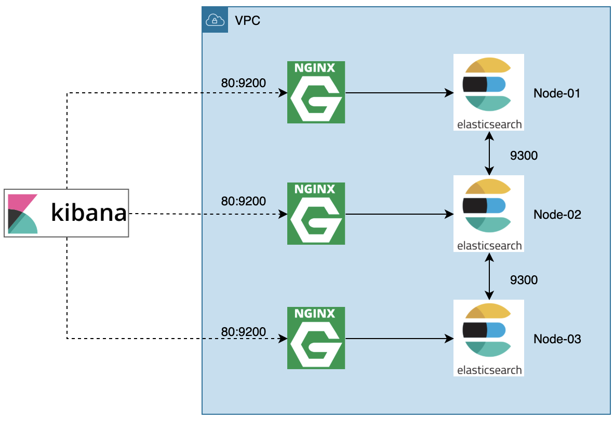
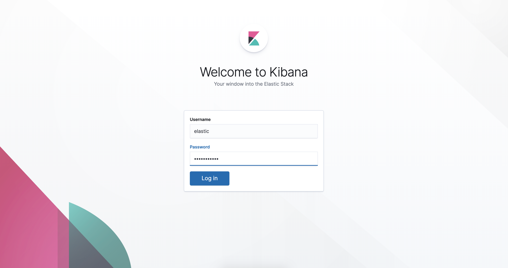

😃 Bootstrap Elasticsearch Cluster with docker-compose in different Availability Zone.

# Features

- Restrict Elastic to Elastic networks inside VPC only (No public access)
- Runnable on multiple different instances

## Why use nginx?

- To deny public ip access to 9200 port

## Usage

First of all, replace all `${INTERNAL_HOST_1}`, `${INTERNAL_HOST_2}`, `${INTERNAL_HOST_3}` inside `docker-compose.yml`, `nginx config` and `kibana.yml` with each instances' internal ip address.

For example, (in `docker-compose.yml`)

```
extra_hosts:
    - "es01.example.com:172.26.2.66"
    - "es02.example.com:172.26.4.100"
    - "es03.example.com:172.31.6.133"
```

Now run containers inside different three instances.

```
docker-compuse up elastic01 elasticsearch-node1-proxy # Node 1
docker-compuse up elastic02 elasticsearch-node2-proxy # Node 2
docker-compuse up elastic03 elasticsearch-node3-proxy # Node 3
docker-compuse up kibana
```

You can login with `elastic` / `my_password`


